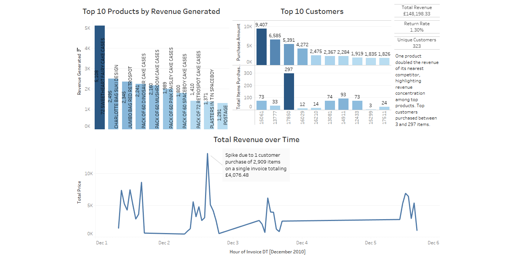

# 🛍️ E-Commerce Sales Analysis

**Author:** Anthony Fumagalli  
**Date:** July 2025  
**Tools:** Google Sheets, Tableau Public  

## 📌 Project Overview

This project analyzes a 5-day window of online retail transactions to identify revenue trends, customer behavior, and product performance using real-world data. The goal was to surface actionable insights for business growth while demonstrating skills in data wrangling and visualization.

## 🧹 Data Preparation

- **Source:** [UCI Machine Learning Repository – Online Retail Dataset](https://archive.ics.uci.edu/ml/datasets/online+retail)
- **Subset Used:** First 10,000 rows (Dec 1–5, 2010)
- **Cleaning Steps:**
  - Removed rows with blank `CustomerID`
  - Flagged returns with a `"Returned?"` column based on negative quantity
  - Extracted clean dates (`IDate`) from `InvoiceDate`
  - Calculated `TotalPrice` (Quantity × UnitPrice), excluding returns

## 📊 Dashboard

**🔗 Tableau Public Link:** [View Dashboard](https://public.tableau.com/views/E-CommerceSalesDashboard5-DayTransactionAnalysis/OnlineRetail-10kVersion?:language=en-US&publish=yes&:sid=&:redirect=auth&:display_count=n&:origin=viz_share_link)

### Key Visuals:
- Top 10 Products by Revenue
- Top 10 Customers (spend vs. items purchased)
- Revenue Over Time (hourly)
- KPI Cards: Total Revenue, Return Rate, Unique Customers

## 🔍 Insights

> One product doubled revenue of its nearest competitor, highlighting concentration among top products. Top customers bought between 3 and 297 items.

## 📁 Files in This Repo

| File | Description |
|------|-------------|
| `Online Retail - First 10k Rows.csv` | Cleaned and filtered transactional data |
| `Online Retail - Data Notes.pdf` | Data prep steps, summary, and documentation |
| `dashboard_screenshot.png` | Visual preview of the dashboard |
| `README.md` | Project explanation and key insights |

## 📌 Next Steps

- Segment customers by purchase patterns
- Expand to a longer date range
- Create product category aggregations for deeper trend analysis
